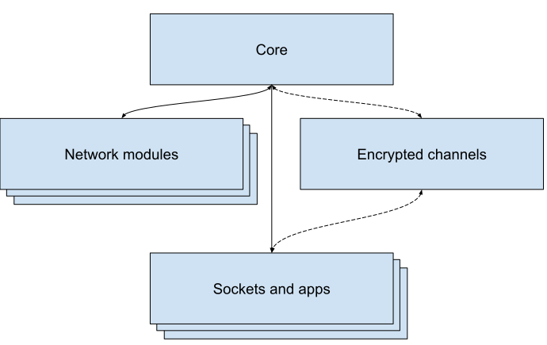

# Сетевой протокол StarWave
Read this in other languages: [English](README.MD), [Русский](README_RU.MD)

## Введение
### Что такое StarWave?
Ранее выпущенный в рамках платформы блокчейн iZ³, StarWave - это протокол обмена сообщениями, который предоставляет возможность создавать зашифрованные каналы высокой скорости между узлами в p2p-режиме.

Сеть разработана таким образом, чтобы быть не убиваемой и безопасной, и она основана на принципах автоматического построения маршрутов и шифрования данных. Одной из основных особенностей является то, что сеть работает поверх множества других сетей, таких как web2, сеть Tor и т. д., поэтому ее можно использовать в любой среде.

Это референсная реализация узла протокола StarWave на Node.js.

### Как это работает?

### Адреса и ключи
StarWave 2 использует адреса и ключи шифрования на основе криптографии Ethereum. Адрес - это строка длиной 20 байт, а ключ - строка длиной 32 байта. Адрес используется для идентификации узла в сети, а ключ используется для шифрования данных.

### Модель протокола

Протокол является многоуровневым, каждый из уровней обеспечивает определенные функции. На текущий момент представлены следующие уровни:

1. Ядро
2. Сетевые модули
3. Протокол шифрованных каналов
4. Сокеты и приложения

#### Ядро
Ядро обеспечивает основные функции менеджмента сообщений, управление роутером, обеспечение проверки подписи, построения маршрутов узлов и проверки целостности.

#### Сетевые модули
Эти модули представляют собой внутренние и внешние реализации обмена данными между узлами.
Сетевые модули должны обеспечивать:
1. Поиск узлов в соответствии с поддерживаемым протоколом
2. Построение списка адресов подключенных узлов (желательно с проверкой подписи)
3. Непосредственную передачу сообщений между узлами
4. Переподключение к узлам при обрыве соединения и контроль сетевых ошибок

#### Протокол шифрованных каналов
На данный момент представлен реализацией обмена ключами по методу Диффи-Хеллмана и шифрованием данных по алгоритму AES-256 с DH_PRIME_LENGTH = 512 бит.
Шифрование обеспечивается встроенным криптомодулем алгоритмом aes-256-cbc. Ключ шифрования = sha256(DH_NODE_KEY).
Подключенные сессии шифруются каждая своим ключом и хранится в памяти узла.

#### Сокеты и приложения

